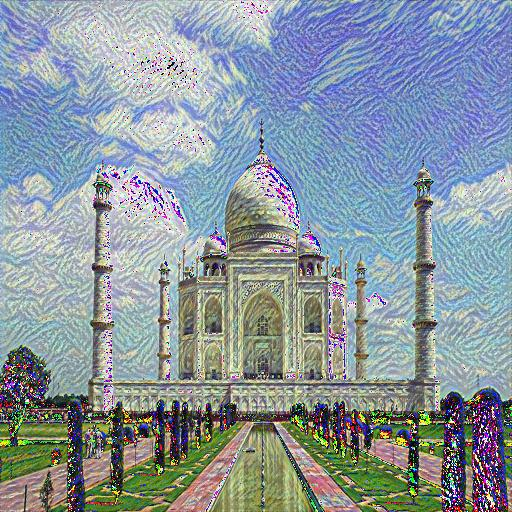

# 🖼️ PRODIGY_GA_05 – Neural Style Transfer with PyTorch

This project applies the artistic style of a famous painting (like *Starry Night*) to a target content image (like a photo of a person or landmark), using **Neural Style Transfer (NST)** with PyTorch.

---

## 📷 Example Output

> 🎨 Style: Starry Night by Van Gogh
> 🖼️ Content: Taj Mahal  
> 💡 Output:



---

## 🛠️ How to Run

### 🧾 1. Install dependencies
```bash
pip install -r requirements.txt
### 🖼️ 2. Add your images
Place a content image in images/content.jpg

Place a style image in images/style.jpg

### ▶️ 3. Run the script
python style_transfer.py
Final stylized image will be saved in output/stylized_output.jpg

## 🗂️ Project Structure
PRODIGY_GA_05/
├── images/
│   ├── content.jpg
│   └── style.jpg
├── output/
│   └── stylized_output.jpg
├── style_transfer.py
├── requirements.txt
└── README.md

## 🧠 How It Works
The model:
1. Uses a pre-trained VGG19 network
2. Preserves content from the input image
3. Applies artistic style from the style image via Gram matrices

## 🚀 Credits
Developed as part of the Prodigy InfoTech Internship.
